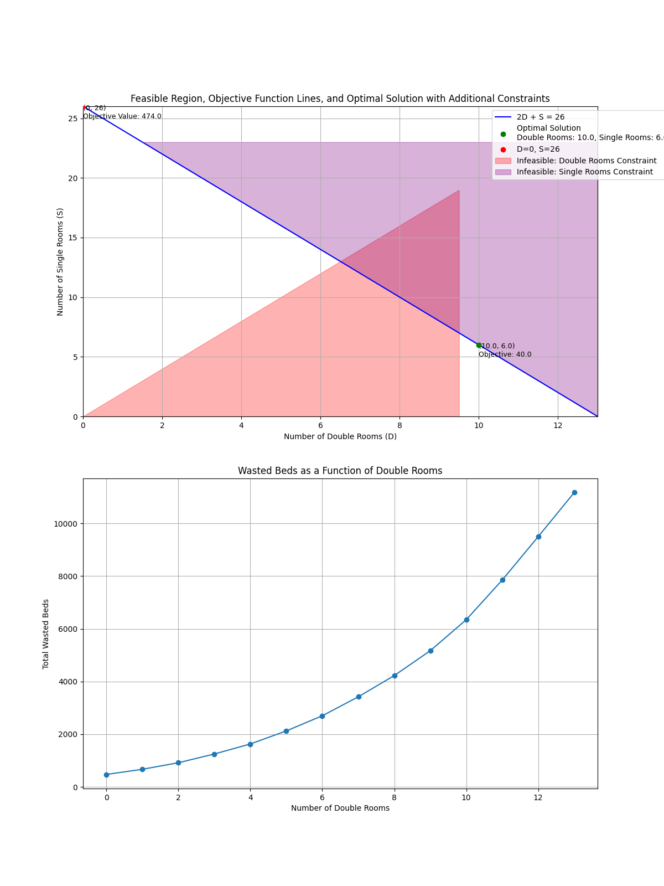

# Inpatient Psych Ward Space Optimization

## Project Overview

This project aims to model the most efficient use of space for an inpatient psych ward certified to hold up to 26 patients. The objective is to find an optimal combination of double and single rooms to minimize wasted space and ensure efficient utilization of beds.

## Methodology

The project includes two main scripts:
1. `optimizer.py`: Uses linear programming to find the optimal number of double and single rooms that minimize wasted beds.
2. `tracker.py`: Evaluates all possible combinations of double and single rooms and tracks the efficiency of each combination.

`main.py` runs them together.

### Optimization Approach

- **Decision Variables**: Number of double rooms (D) and single rooms (S).
- **Constraints**: 
  - Total number of beds (2D + S) must equal 26.
  - Ensure enough rooms for patients requiring single rooms.
  - Allow double room patients to occupy either single or double rooms.
- **Objective Function**: Minimize the total number of wasted beds.

A high-level overview of the approach includes:
1. **Defining the Objective Function**: The objective is to minimize the total number of wasted beds.
2. **Setting Decision Variables**: The number of double rooms (D) and single rooms (S).
3. **Establishing Constraints**: Ensuring the total number of beds is 26, and there are enough rooms for patients requiring single rooms while allowing double room patients to occupy any room type.
4. **Solving the Linear Program**: Using linear programming techniques to find the optimal values for D and S that minimize the objective function.
5. **Interpreting Results**: Extracting and analyzing the optimal room configuration and the associated number of wasted beds.

### Tracking Efficiency

- Evaluates each possible combination of double and single rooms.
- Calculates the number of wasted beds for each combination across all days.
- Identifies the combination with the least wasted beds.

## Results

### Optimization Results

The optimization script (`optimizer.py`) provided the following results:

- Optimal number of double rooms: **10.0**
- Optimal number of single rooms: **6.0**
- Total wasted beds: **40.0**
- Total free beds: **0.0**
- Efficiency: **1.00**
- Solver Status: **Optimal**
- Objective Function Value: **40.0**

### Efficiency Tracking Results

The efficiency tracker script (`tracker.py`) evaluated all combinations and found that the configuration with the least wasted beds is:

- **0 double rooms** and **26 single rooms** with **474** wasted beds.

### Detailed Efficiency Results

| Double Rooms | Single Rooms | Wasted Beds |
|--------------|--------------|-------------|
| 0            | 26           | 474.0       |
| 1            | 24           | 670.0       |
| 2            | 22           | 918.0       |
| 3            | 20           | 1250.0      |
| 4            | 18           | 1630.0      |
| 5            | 16           | 2126.0      |
| 6            | 14           | 2700.0      |
| 7            | 12           | 3420.0      |
| 8            | 10           | 4226.0      |
| 9            | 8            | 5168.0      |
| 10           | 6            | 6345.0      |
| 11           | 4            | 7851.0      |
| 12           | 2            | 9497.0      |
| 13           | 0            | 11170.0     |

**Most efficient setup:**
- Double Rooms: **0**
- Single Rooms: **26**
- Wasted Beds: **474**

## Conclusion



### Linear Programming Optimization Results
The linear programming optimization (`optimizer.py`) suggests having **10 double rooms and 6 single rooms**. This result is based on minimizing the total number of wasted beds while satisfying the constraints of room availability and patient needs.


### Exhaustive Combination Results
The exhaustive combination evaluation implies the best route is **0 Double rooms, and 26 single rooms**, with the wasted space visualized as:


### Why Different Answers?

The discrepancy between the linear programming optimization and the exhaustive combination evaluation arises due to the different methodologies and objectives:

- `optimizer.py` focuses on finding the optimal configuration by minimizing wasted beds over the entire period.
- `tracker.py` evaluates all possible combinations and calculates the number of wasted beds for each combination, identifying the setup with the absolute minimum number of wasted beds for each specific day, without considering the overall distribution of room types.

The optimizer aims to balance the room allocation over the entire dataset, resulting in fewer wasted beds overall, while the tracker identifies the configuration that results in the least wasted beds for each day individually, potentially leading to higher total wasted beds when summed over the period.

### Pros and Cons of the Optimal Setup (10 Double Rooms, 6 Single Rooms)

**Pros**:
- **Flexibility**: This setup provides flexibility to accommodate different types of patients, ensuring optimal utilization of available space.
- **Balanced Utilization**: By having both double and single rooms, the setup can efficiently handle varying patient needs, reducing the chances of underutilization.

**Cons**:
- **Complexity in Room Allocation**: Managing a mix of double and single rooms can be more complex, requiring careful planning to ensure patients are assigned appropriately.
- **Potential Wasted Beds**: Although this setup is optimal for minimizing wasted beds over the evaluated period, it still results in some wasted beds.

### Pros and Cons of the Optimal Setup (10 Double Rooms, 6 Single Rooms)

**Pros**:
- **Minimal Wasted Beds**: This setup results in the least number of wasted beds (40) over the evaluated period, ensuring maximum efficiency.
- **Flexibility**: This setup provides flexibility to accommodate different types of patients, ensuring optimal utilization of available space.
- **Balanced Utilization**: By having both double and single rooms, the setup can efficiently handle varying patient needs, reducing the chances of underutilization.

**Cons**:
- **Complexity in Room Allocation**: Managing a mix of double and single rooms can be more complex, requiring careful planning to ensure patients are assigned appropriately.

### Pros and Cons of the Most Efficient Setup (0 Double Rooms, 26 Single Rooms)

**Pros**:
- **Simplicity**: Having all single rooms simplifies room allocation, as each patient gets a single room regardless of their needs, eliminating the complexity of deciding which patients can share rooms.

**Cons**:
- **Higher Wasted Beds**: This setup results in more wasted beds (474) over the evaluated period compared to the optimal setup.
- **Lack of Flexibility**: This setup lacks the flexibility to accommodate patients who can share rooms, potentially leading to underutilization if there are many patients who can be paired.
- **Increased Costs**: Single rooms typically require more resources (space, utilities, staffing), potentially increasing operational costs compared to a balanced mix of room types.

## Recommendation

Based on these findings, the hospital should consider the trade-offs between flexibility and operational constraints:

- If the priority is to minimize wasted beds, the hospital should opt for the optimal setup (10 double rooms and 6 single rooms), which resulted in only 40 wasted beds.
- If operational simplicity and minimizing complexity in room allocation are important, the hospital might consider the all-single-room setup (0 double rooms, 26 single rooms), even though it results in more wasted beds (474).

Ultimately, the decision should also factor in other operational considerations such as staffing, patient preferences, and cost implications. Implementing a dynamic allocation system that can adjust room assignments based on daily patient inflow and needs could also be beneficial.


## Usage

### Prerequisites
Ensure you have the necessary dependencies installed. You can install them using `requirements.txt`:

```sh
pip install -r requirements.txt
```

## Running the Scripts

### Running the Optimization Script
The `optimizer.py` script uses linear programming to find the optimal number of double and single rooms that minimize wasted beds.

```sh
python optimizer.py
```

### Running the Efficiency Tracker Script
The `tracker.py` script evaluates all possible combinations of double and single rooms and tracks the efficiency of each combination.

```sh
python tracker.py
```

The `main.py` script runs both the optimization and efficiency tracker scripts together.

```sh
python main.py
```


### Running with Docker
You can also run the project using Docker. Ensure Docker is installed and running on your system.

#### Building the Docker Image

Build the Docker image using the provided dockerfile:


```sh
docker-compose build   
```

```sh
docker-compose up   
```
