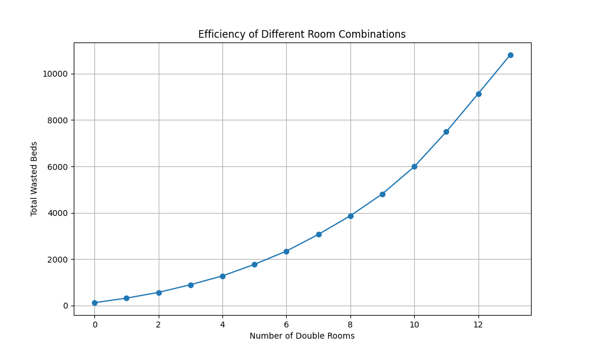

# Inpatient Psych Ward Space Optimization

## Project Overview

This project aims to model the most efficient use of space for an inpatient psych ward certified to hold up to 26 patients. The objective is to find an optimal combination of double and single rooms to minimize wasted space and ensure efficient utilization of beds.

## Methodology

The project includes two main scripts:
1. `optimizer.py`: Uses linear programming to find the optimal number of double and single rooms that minimize wasted beds.
2. `tracker.py`: Evaluates all possible combinations of double and single rooms and tracks the efficiency of each combination.

`main.py` runs them together.

### Optimization Approach

- **Decision Variables**: Number of double rooms (D) and single rooms (S).
- **Constraints**: 
  - Total number of beds (2D + S) must equal 26.
  - Ensure enough rooms for patients requiring single rooms.
  - Allow double room patients to occupy either single or double rooms.
- **Objective Function**: Minimize the total number of wasted beds.

**Linear Programming**: Linear programming is a mathematical method used for optimizing a linear objective function, subject to linear equality and inequality constraints. It is widely used in various fields for resource optimization, scheduling, and planning. 

A high-level overview of the approach includes:
1. **Defining the Objective Function**: The objective is to minimize the total number of wasted beds.
2. **Setting Decision Variables**: The number of double rooms (D) and single rooms (S).
3. **Establishing Constraints**: Ensuring the total number of beds is 26, and there are enough rooms for patients requiring single rooms while allowing double room patients to occupy any room type.
4. **Solving the Linear Program**: Using linear programming techniques to find the optimal values for D and S that minimize the objective function.
5. **Interpreting Results**: Extracting and analyzing the optimal room configuration and the associated number of wasted beds.

### Tracking Efficiency

- Evaluates each possible combination of double and single rooms.
- Calculates the number of wasted beds for each combination across all days.
- Identifies the combination with the least wasted beds.

## Results

### Optimization Results

The optimization script (`optimizer.py`) provided the following results:

- Optimal number of double rooms: **0**
- Optimal number of single rooms: **26**
- Total wasted beds: **178**

### Efficiency Tracking Results

The efficiency tracker script (`tracker.py`) evaluated all combinations and found that the configuration with the least wasted beds is:

- **0 double rooms** and **26 single rooms** with **474** wasted beds.

**Calculating Wasted Beds**
Wasted beds are calculated to measure inefficiencies in room allocation. Here is how wasted beds are determined:

1. Single Room Patients in Double Rooms:
    - If the number of patients requiring single rooms exceeds the available single rooms, the excess patients are placed in double rooms.
    - Each single room patient in a double room wastes one bed.

2. Double Room Utilization:
    - The number of double rooms used is calculated based on the number of double room patients and any excess single room patients placed in double rooms.
    - Wasted double room beds are the difference between the total double room beds and the beds actually used.

3. Closed Rooms:
    - Closed rooms directly contribute to wasted beds since they are unavailable for use.

4. Total Wasted Beds:
    - The total wasted beds for a day are the sum of the wasted single room beds in double rooms and wasted double room beds.

## Conclusion

#### Linear Programming Optimization Results
The linear programming optimization (optimizer.py) suggests having **0 double rooms and 26 single rooms**. This result is based on minimizing the total number of wasted beds while satisfying the constraints of room availability and patient needs.

#### Exhaustive Combination Results
The exhaustive combination evaluation implies the best route is **0 Double rooms, and 26 single rooms**, with the wasted space visualized as:



##### Why Different Answers?

The discrepancy between the linear programming optimization and the exhaustive combination evaluation arises due to the different methodologies and objectives:

- Optimizer.py focuses on finding the optimal configuration by minimizing wasted beds over the entire period.
- Tracker.py evaluates all possible combinations and calculates the number of wasted beds for each combination, identifying the setup with the absolute minimum number of wasted beds for each specific day, without considering the overall distribution of room types.

The optimizer aims to balance the room allocation over the entire dataset, resulting in fewer wasted beds overall, while the tracker identifies the configuration that results in the least wasted beds for each day individually, potentially leading to higher total wasted beds when summed over the period.

## Pros and Cons of the Optimal Setup (0 Double Rooms, 26 Single Rooms)

**Pros**:

- **Minimal Wasted Beds**: This setup results in the minimal number of wasted beds over the evaluated period, ensuring maximum efficiency.
- **Simplicity**: Having all single rooms simplifies room allocation, as each patient gets a single room regardless of their needs, eliminating the complexity of deciding which patients can share rooms.

**Cons**:

- **Lack of Flexibility**: This setup lacks the flexibility to accommodate patients who can share rooms, potentially leading to underutilization if there are many patients who can be paired.
- **Operational Constraints**: Hospitals may have operational constraints that require a mix of room types to handle different patient flows, making an all-single-room setup impractical.
- **Increased Costs**: Single rooms typically require more resources (space, utilities, staffing), potentially increasing operational costs compared to a balanced mix of room types.

#### Recommendation

Based on these findings, the hospital should consider the trade-offs between flexibility and operational constraints:

- If the priority is to minimize wasted beds, the hospital might lean towards the all-single-room setup (26 single rooms).

Ultimately, the decision should also factor in other operational considerations such as staffing, patient preferences, and cost implications. Implementing a dynamic allocation system that can adjust room assignments based on daily patient inflow and needs could also be beneficial.

## Usage

### Prerequisites
Ensure you have the necessary dependencies installed. You can install them using `requirements.txt`:

```sh
pip install -r requirements.txt
```

## Running the Scripts

### Running the Optimization Script
The `optimizer.py` script uses linear programming to find the optimal number of double and single rooms that minimize wasted beds.

```sh
python optimizer.py
```

### Running the Efficiency Tracker Script
The `tracker.py` script evaluates all possible combinations of double and single rooms and tracks the efficiency of each combination.

```sh
python tracker.py
```

The `main.py` script runs both the optimization and efficiency tracker scripts together.

```sh
python main.py
```


### Running with Docker
You can also run the project using Docker. Ensure Docker is installed and running on your system.

#### Building the Docker Image

Build the Docker image using the provided dockerfile:


```sh
docker-compose build   
```

```sh
docker-compose up   
```
