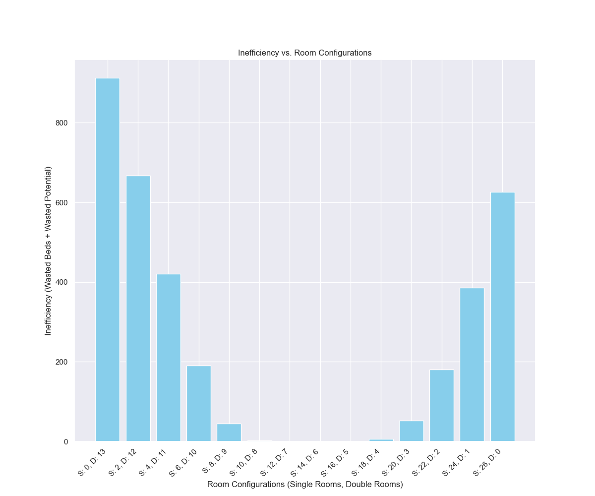
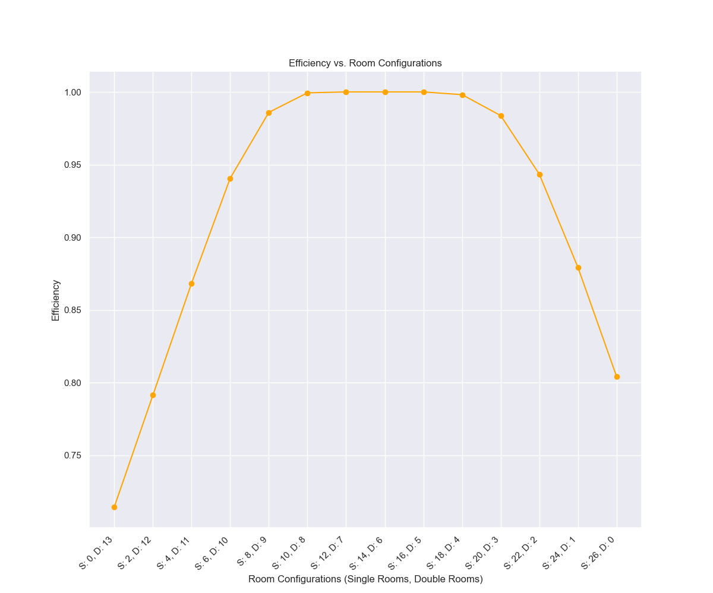
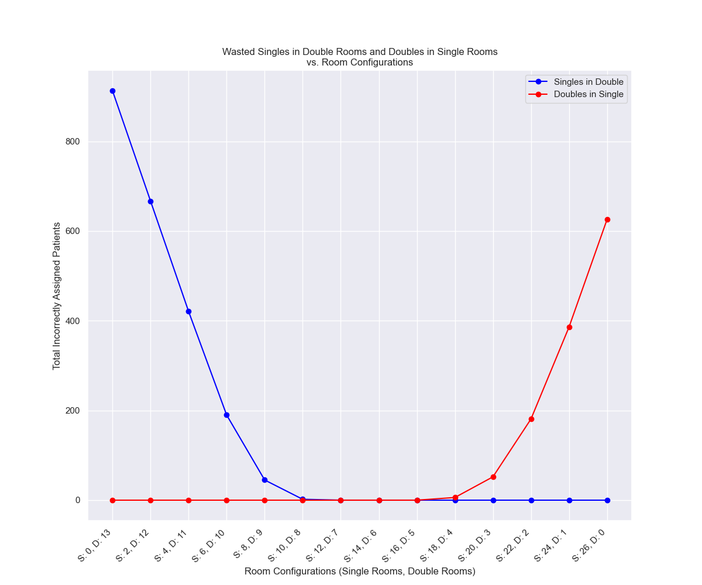

# Psychiatric Ward Room Configuration Evaluation
## Test Period: May-August 2024

### Overview
This evaluation assessed the performance of our optimized room configuration (10 Single, 8 Double Rooms) against unseen test data. The configuration demonstrated exceptional efficiency with minimal resource wastage. In the entire 4-month test period, inefficiencies only occurred on May 12-13 when we had 11 single room patients but only 10 single rooms available, resulting in one single patient requiring a double room.

### Key Results
- **Configuration:** 10 Single Rooms, 8 Double Rooms
- **Total Capacity:** 26 beds
- **Efficiency:** 99.99%
- **Wasted Resources:**
  - Wasted Beds: 2 (single patients in double rooms)
  - Wasted Space: 0 (no double patients split into singles)

### Data Visualization

#### 1. Room Configuration Inefficiency Bar Chart

This graph shows the total inefficiency (wasted beds + wasted potential) across different room configurations. The selected configuration (S:10, D:8) demonstrates minimal inefficiency compared to more extreme ratios of single to double rooms.

#### 2. Room Configuration Efficiency Plot

The efficiency curve demonstrates that our chosen configuration achieves near-perfect efficiency (≈1.0). Configurations with more extreme ratios of single to double rooms show lower efficiency scores, ranging from 0.80 to 0.95.

#### 3. Room Configuration Heatmap

This heatmap visualizes the total number of incorrectly assigned patients across different room configurations. The optimal zone (yellow region) includes our selected configuration (10S, 8D), showing minimal misassignments.

#### 4. Wasted Patient Assignments Analysis

This graph shows the breakdown of assignment mismatches:
- Blue line: Single patients incorrectly placed in double rooms
- Red line: Double patients incorrectly placed in single rooms
The selected configuration sits at the intersection point where both types of misassignments are minimized.

### Test Data Insights
- Patient census ranged from 7-16 patients per day
- Single room patients: 4-11 per day
- Double room patients: 1-9 per day
- The two wasted beds occurred during a brief period in May
- No instances of having to split double room patients into singles

### Optimization Results Data
```
Date,Available Beds,Wasted Beds,Wasted Potential,Daily Efficiency
2024-05-01,26,0.0,0,1.0
...
2024-05-12,26,1.0,0,0.9615384615384616
2024-05-13,26,1.0,0,0.9615384615384616
2024-05-14,26,0.0,0,1.0
...
2024-08-31,26,0.0,0,1.0

Final Cumulative Efficiency: 0.9993446920052425
```
Full dataset available in: output/optimized_model_data_test_set.csv

### Conclusion
The evaluation confirms that the optimized configuration performs exceptionally well on unseen data, maintaining high efficiency while accommodating natural variations in patient admission patterns. The optimization results data shows that the only efficiency drops occurred during two days in May, with perfect efficiency maintained throughout the rest of the test period.

---
*Data Source: May-August 2024 Test Dataset*