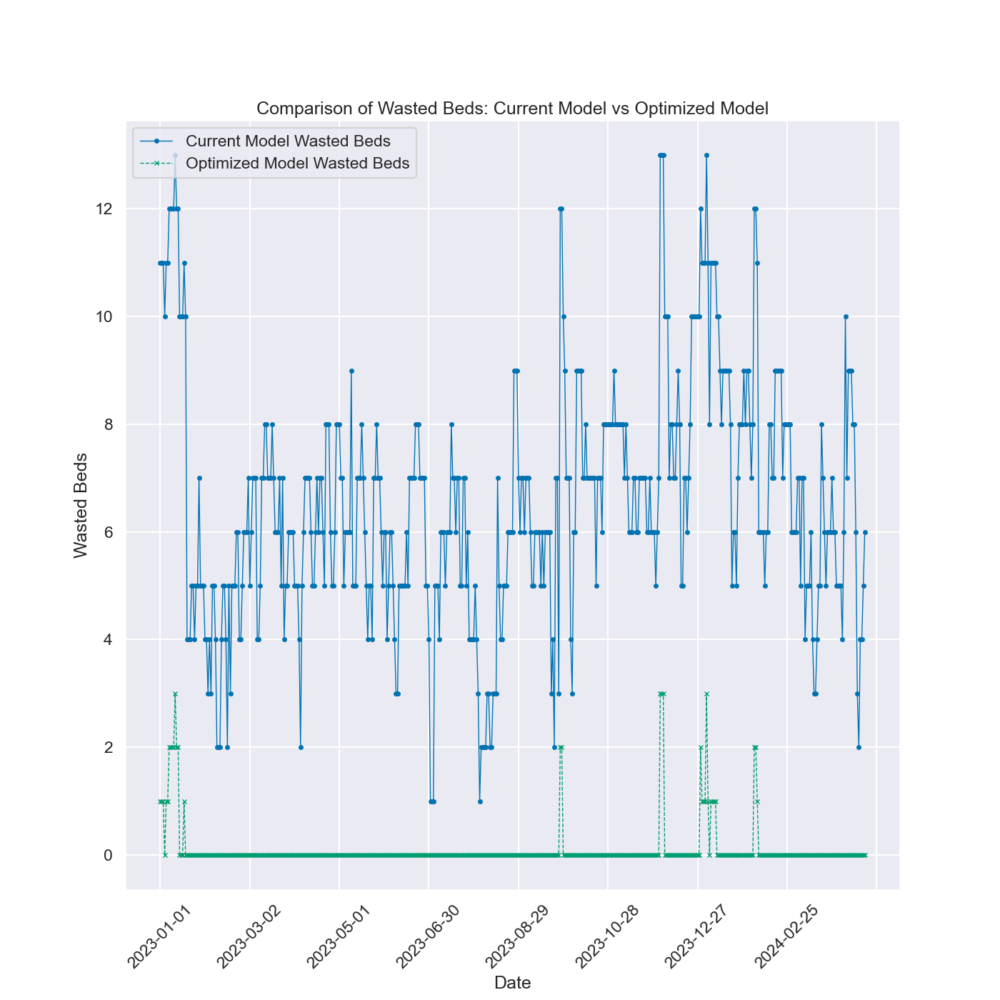
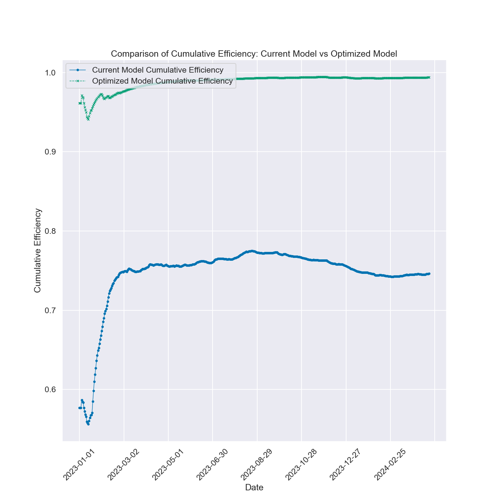

# Inpatient Psych Ward Space Optimization Report

## Introduction

This report evaluates the efficiency of two different bed allocation methodologies in an inpatient psych ward setting. The goal is to optimize the use of available beds, minimizing wasted beds while ensuring patient needs are met. The comparison is made between the current bed allocation method and a new approach derived from a linear programming optimization.

### Wasted Beds

In the context of this study, a "wasted bed" is defined as a bed that cannot be utilized due to specific patient needs:

- **Current Model:** In the current model, all rooms are double rooms, meaning they have two beds each. A bed is considered "wasted" when a patient has extra needs and must be isolated, occupying a double room alone. The second bed in that room becomes unavailable to other patients, and thus, it is wasted.

- **Optimized Model:** Under the new optimized model, rooms are a mix of single and double rooms. A bed is considered "wasted" in the same way as in the current model, but this only happens after all single-bed rooms are full. If a patient requiring isolation must be placed in a double room, the other bed in that double room is then wasted.

## Defining Efficiency

In this study, "efficiency" refers to the effective utilization of available beds in the ward. Specifically, efficiency is calculated as the ratio of occupied beds (excluding wasted beds) to the total number of available beds.

### Efficiency Calculation

- **Daily Efficiency:** This is calculated on a daily basis as:
  `Daily Efficiency = (Total Available Beds - Wasted Beds) / Total Available Beds`

- **Cumulative Efficiency:** This tracks efficiency over time, providing insight into long-term trends in bed utilization:
  `Cumulative Efficiency = Cumulative Occupied Beds / Cumulative Available Beds`

The goal is to maximize efficiency, ensuring that as few beds as possible are wasted while meeting the needs of patients.

## Linear Programming and Optimizer Solution

Linear programming (LP) is a mathematical technique used to find the best possible outcome in a given model, where the model is represented by linear relationships. It is commonly used in various fields, including economics, engineering, and logistics, to optimize processes while adhering to specific constraints.

In this project, the goal was to minimize the number of wasted beds in an inpatient psych ward by optimizing the allocation of double and single rooms. The optimization problem was formulated as a linear program, where the objective function and constraints were defined as follows:

### Objective Function

The objective function is the function that we want to minimize or maximize. In our case, the goal was to **minimize the total number of wasted beds** in the ward. The optimizer script calculates the total wasted beds based on the room configuration and patient needs.

**Mathematically:**

Minimize: `total_wasted_beds`

Where `total_wasted_beds` is the sum of unused double beds and single-room patients placed in double rooms (which leaves one bed in the double room wasted).

### Decision Variables

In linear programming, decision variables represent the quantities we can control or adjust to achieve the desired outcome. In our optimizer, the decision variables were:

- **D:** The number of double rooms (ranging from 0 to 13).
- **S:** The number of single rooms (ranging from 0 to 26).

Additionally, we had variables to represent:

- **single_in_double:** The number of single-room patients placed in double rooms.
- **unused_double_beds:** The number of unused beds in double rooms.

### Constraints

Constraints are the conditions that must be satisfied in the model. In this optimization problem, the constraints included:

1. **Total Bed Constraint:**
   - The total number of beds in the ward is fixed at 26. Since each double room has 2 beds, the constraint is expressed as:
   `2D + S = 26`

2. **Single Room Capacity Constraint:**
   - The number of single rooms plus any single-room patients placed in double rooms must be greater than or equal to the number of patients requiring single rooms on any given day:
   `S + single_in_double_i >= single_rooms_needed_i`

3. **Double Room Capacity Constraint:**
   - The number of double rooms should be sufficient to accommodate the patients who can share rooms:
   `double_rooms_needed_i <= 2D`

4. **Unused Double Beds Calculation:**
   - Unused double beds are calculated based on the number of available beds in double rooms minus the number of double-room patients and single-room patients placed in double rooms:
   `unused_double_beds_i = 2D - double_rooms_needed_i - single_in_double_i`

5. **Total Wasted Beds:**
   - The total wasted beds is the sum of single-room patients in double rooms and unused double beds. The optimizer aims to minimize this value:
   `total_wasted_beds >= single_in_double_i + unused_double_beds_i`

### Solver and Results

The optimizer used a linear programming solver (PULP with CBC) to find the optimal values for the decision variables that minimize the total number of wasted beds while satisfying all constraints.

The solution produced by the optimizer was as follows:

- **Optimal number of double rooms:** 8.0
- **Optimal number of single rooms:** 10.0
- **Total wasted beds:** 52.0
- **Total wasted potential:** 22.0
- **Solver status:** Optimal
- **Objective function value:** 74.0

This means that the most efficient allocation of beds, given the constraints and patient needs, is to have 8 double rooms and 10 single rooms, which minimizes wasted beds to just 52 across the evaluated period.

## Report Aim

This report aims to compare the efficiency of the current bed allocation method against the new optimized solution. The key metrics considered are wasted beds and overall efficiency.

## Results Discussion

The following visualizations and tables provide a comparison between the current and optimized models:

### Wasted Beds Comparison

The graph shows the number of wasted beds over time for both the current and optimized models. As can be seen, the optimized model significantly reduces the number of wasted beds compared to the current model.

### Daily Efficiency Comparison

This graph compares the daily efficiency of bed usage between the two models. The optimized model consistently shows higher efficiency, indicating better utilization of available beds.

### Cumulative Efficiency Comparison

The cumulative efficiency graph provides an overview of how efficiency trends over time. The optimized model achieves and maintains higher cumulative efficiency compared to the current model.

## Conclusions

The optimized model clearly outperforms the current model in terms of minimizing wasted beds and maximizing efficiency. This suggests that adopting the new room allocation strategy could lead to better utilization of resources in the ward.

## Additional Considerations

While the optimized model provides significant improvements, there are other factors that need to be considered:

- **Long-Term Trends:** The model could be further refined by analyzing long-term trends in patient needs and room utilization.

## Future Plans

To build on the success of this project, the following steps could be taken:

- **Dynamic Allocation:** Implement a system that dynamically adjusts room assignments based on real-time data.
- **Expand Scope:** Consider expanding the model to optimize other resources, such as staff or medical equipment.
